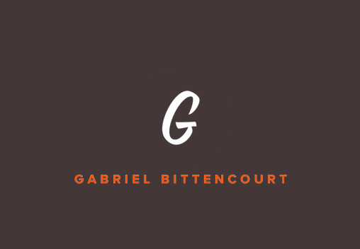

  
   
  <strong>Repositorio para o meu portfolio pessoal.</strong>

---

## 📝 Sobre
Portfolio criado no intuito de mostrar meus projetos e falar um pouco sobre mim, está é a primeira versão dele então ao passar do tempo pretendo realizar alterações e cada vez mais implementar novas funcionalidades e estilos para ele.

## 🔧 Tecnologias
Para a construção do portfolio eu utilizei:

  
  
  

## 👨🏽‍💻 Autor
#### Feito com 🤎 por *[Gabriel Bittencourt Penteado](https://www.linkedin.com/in/gabriel-bittencourt-penteado/)*. Entre em contato! 👋🏽